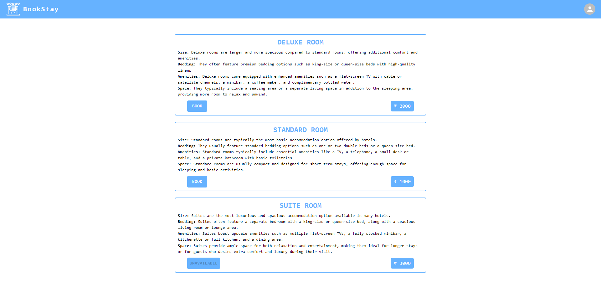

# hotel-booking-application-frontend
This is the frontend repository for hotel booking application

1. clone this repository <code>https://github.com/0-jagadeesh-0/hotel-booking-application-frontend.git</code>

2. <code>npm install</code> to install all the required dependencies

3. <code>npm start</code> to start the application

## Website Link
### [Website Link](https://book-stay.netlify.app/)

## Some screenshots of the website images

